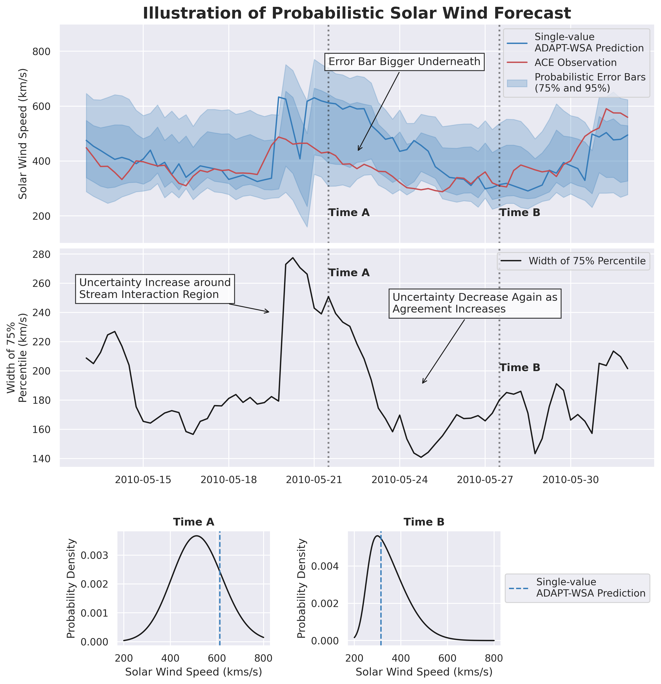

# Post-processing Probabilistic Forecasts of the Solar Wind by Data Mining Similar Scenarios

This code accompanies the paper *Post-processing Probabilistic Forecasts of the Solar Wind by Data Mining Similar Scenarios*, to be published in the AGU Journal Space Weather in 2026.
This code generates probabilistic forecasts of the solar wind speed using a 11-year historical record of ADAPT-WSA forecasts and ACE observations at L1.

The methodology used here builds on [k-NN methods](https://en.wikipedia.org/wiki/K-nearest_neighbors_algorithm), [analog ensembles](https://ral.ucar.edu/sites/default/files/public/images/events/WISE_documentation_20170725_Final.pdf), and the [skew normal distribution](https://en.wikipedia.org/wiki/Skew_normal_distribution).

The solar wind predictions from WSA for use with this code can be downloaded from Zenodo. The full WSA runs (including FITS output) are [available on HuggingFace](https://huggingface.co/datasets/ddasilva/probabilistic-solar-wind).

## Contact
The author can be reached at [daniel.e.dasilva@nasa.gov](daniel.e.dasilva@nasa.gov) or [mail@danieldasilva.org](mail@danieldasilva.org).

